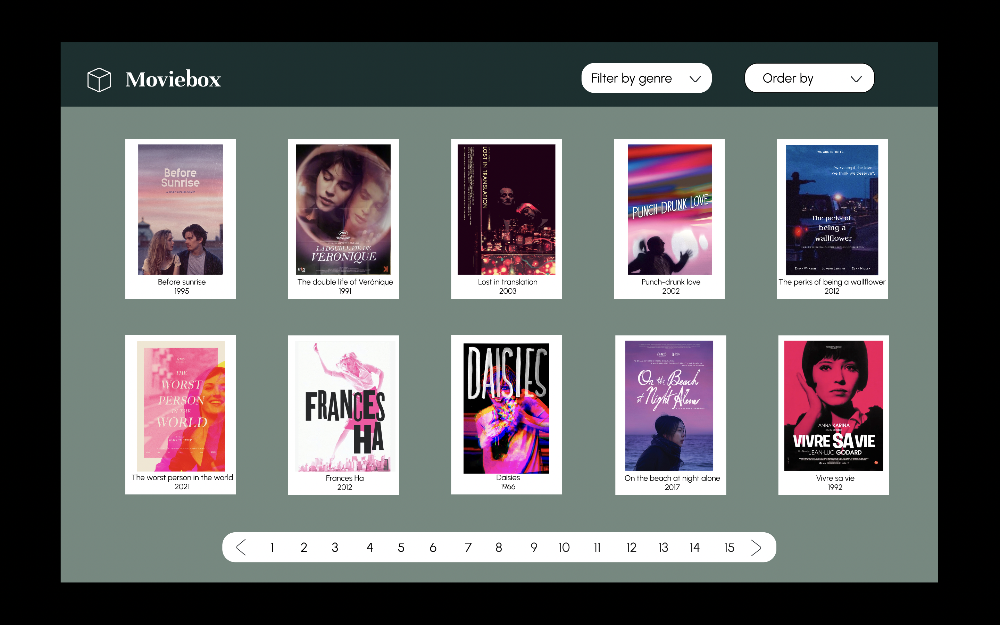
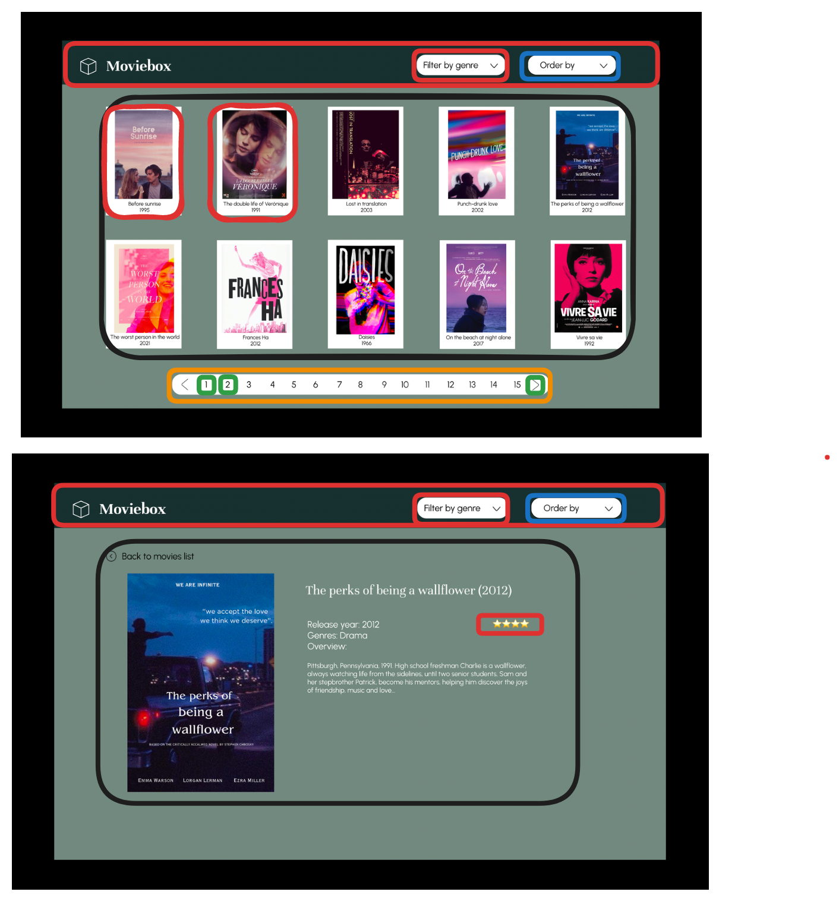
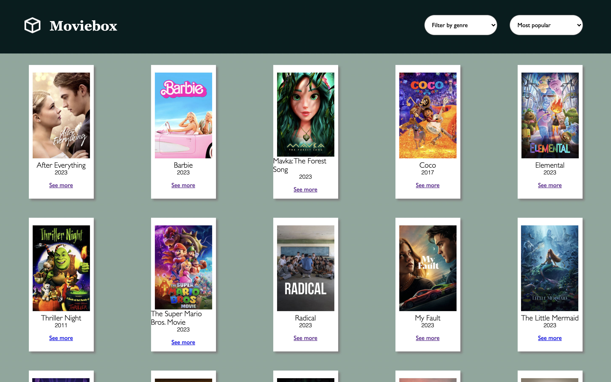
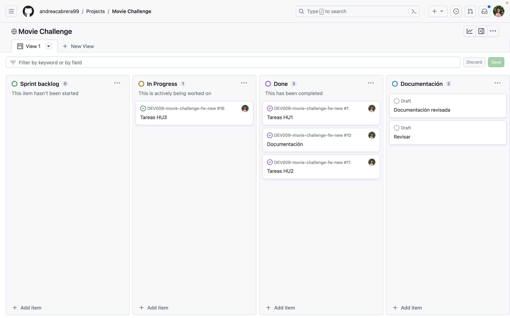

# Movie Challenge con React

## Índice

- [1. Preámbulo](#1-preambulo)
- [2. Resumen del proyecto](#2-resumen-del-proyecto)
- [3. Funcionalidades](#3-funcionalidades)
- [4. Descripción de archivos](#4-descripción-de-archivos)
- [5. Definición del producto](#5-definición-del-producto)
- [6. Diseño del producto](#6-diseño-del-producto)
- [7. Organización del proyecto](#7-organización-del-proyecto)
- [8. Documentación](#8-documentación)

---

## 1. Preámbulo
Un proveedor de servicios streaming es un servicio por suscripción que ofrece streaming de películas y programas de televisión. La mayoría de estos servicios son propiedad de un importante estudio cinematográfico. Los servicios de streaming comenzaron como un complemento de las ofertas de Blu-ray, que son complementos de los programas vistos.

Algunos servicios de streaming populares incluyen Twitch, Crunchyroll, Disney+, Star+, Apple TV+, Funimation, HBO Max, Netflix, Prime Video, DirecTV Go, Paramount+ y otros sitios que transmiten películas y programas de televisión. 

Este tipo de servicios son muy demandados en todo el mundo. Como ejemplo, se estima que las plataformas de streaming en México, generaron ingresos por aproximadamente 700 millones de dólares en 2019, lo cual se espera duplicar para el 2024. Es decir, es un servicio que crece de forma muy rápida, tanto por los nuevos usuarios como por la creciente oferta en el mercado. 

## 2. Resumen del proyecto
Moviebox es una interfaz que le permite al usuario acceder a un catálogo de películas para conocer más detalles sobre ellas. El proyecto es una Single Page Application (SPA) desarrollada con React y JavaScript que consume la data de la API [The Movie Database](https://developer.themoviedb.org/docs).

A partir de los endpoints de la API, Moviebox hace peticiones para renderizar un listado general de películas, así como una serie de detalles más específicos de cada una de ellas. Además, la página tiene un filtro de géneros y una opción para ordenar las películas por popularidad y antigüedad.

## 3. Funcionalidades
La página Moviebox cuenta con las siguientes funcionalidades para el catálogo de películas que renderiza:
- Paginación: para navegar por todas las páginas del catálogo, ya sea sin filtros o con filtros.
- Filtro por géneros: para sólo visualizar el catálogo de películas de un género en específico. Los géneros son romance, comedia, drama, familiar, animación, aventura, fantasía, musicales y películas televisivas.
- Ordenamiento: para ordenar las películas de forma ascendente y descendente de acuerdo con los criterios de popularidad y fecha de estreno. El ordenamiento por default del catálogo es 'Most popular'.
- Detalles de las películas: al hacer click en la sección 'See more' de la tarjeta de una película se abre una nueva pestaña con más detalles sobre dicha película en específico.

## 4. Descripción de archivos
* `components`: para la configuración de archivos con las funciones principales se siguió la lógica de los componentes, por lo que cada componente cuenta con su propio archivo de JSX, CSS (ambos en la carpeta `components`) y tests (en la carpeta `test`).  
* `App.jsx`: contiene la petición principal a la API para el renderizado de películas.
* `main.jsx`: contiene el ruteo y la renderización general de toda la interfaz.

## 5. Definición del producto
Para la creación de Moviebox se siguieron tres historias de usuario correspondientes a las funcionalidades pensadas para la interfaz. Los principales usuarios del producto son personas en general que desean conocer principalmente las películas en tendencia, así como los detalles de las películas.

#### [Historia de usuario 1] Listado de películas

Yo como usuario quiero visualizar en un tabla (filas y columnas) el catálogo de películas.

##### Criterios de aceptación

- Se debe usar el _endpoint_ [/discover/movie](https://developer.themoviedb.org/reference/discover-movie).
- La aplicación cuenta con una paginación para explorar el catálogo por páginas.
- Para cada película se debe mostrar como mínimo:
poster, título original y año de lanzamiento.

##### Definición de terminado

- Los componentes desarrollados deben contar con test unitarios.

---

#### [Historia de usuario 2] Filtro y ordenamiento

Yo como usuario quiero filtrar y ordenar el catálogo de películas usando
los criterios soportados por _TheMovie Database API V3_.

##### Criterios de aceptación

- Para filtrar se debe usar el _endpoint_
[/discover/movie](https://developer.themoviedb.org/reference/discover-movie),
y alguno de sus parámetros como _with_genres_.
- Para ordenar se debe usar el _endpoint_
[/discover/movie](https://developer.themoviedb.org/reference/discover-movie),
y alguno de sus parámetros como _sort_by_.
- La paginación debe conservar el filtro y ordenamiento
- Para cada película se debe mostrar como mínimo:
poster, título original y año de lanzamiento.

##### Definición de terminado

- Los componentes desarrollados deben contar con test unitarios.

---

#### [Historia de usuario 3] Detalle de una película

Yo como usuario quiero consultar los detalles de una película.

##### Criterios de aceptación

- Se debe usar el _endpoint_
[/movie/{movie_id}](https://developer.themoviedb.org/reference/movie-details).
- Para la película se debe mostrar como mínimo: poster, título original,
año de lanzamiento, géneros, promedio de votación y total de votos.
- La interfaz debe permitir retornar al listado de películas conservando
el filtro y ordenamiento.

##### Definición de terminado

- Los componentes desarrollados deben contar con test unitarios.

---

## 6. Diseño del producto
Para diseñar la interfaz se contó primero con un prototipo de baja fidelidad con las dos vistas de la SPA.

A partir de estos bocetos después se llevó a cabo un prototipo de alta fidelidad con su versión dinámica en [figma](https://www.figma.com/proto/OcM9RLZOJYDmoVKFDUKcUu/Moviebox?type=design&node-id=18-385&t=7WnAPz1MHbtzAxjA-0&scaling=scale-down&page-id=0%3A1&starting-point-node-id=10%3A132). 

Como un último paso previo al código, se usó esta versión de alta fidelidad para separar la UI en una jerarquía de componentes. 

El producto final tuvo algunos ajustes, pero en general se cuidó el diseño inicial.

## 7. Organización del proyecto
Para la organización del proyecto, se utilizó el siguiente board en [Github Projects](https://github.com/users/andreacabrera99/projects/3), donde se llevó a cabo la planeación del flujo de trabajo a través de milestones y issues en torno a la división de tareas según los tres historias de usuario.

## 8. Documentación
- [Product owner](https://www.youtube.com/watch?v=r2hU7MVIzxs&t=202s)
- [Changelog guide](https://github.com/Laboratoria/changelog-guide/)
- [TMDB](https://developer.themoviedb.org/docs)
- [Movies](https://developer.themoviedb.org/reference/discover-movie)
- [Inicio rápido](https://es.react.dev/learn)
- [Pensar en react](https://es.react.dev/learn/thinking-in-react)
- [Describir la UI](https://es.react.dev/learn/describing-the-ui)
- [Tu primer componente](https://es.react.dev/learn/your-first-component)
- [Importar y exportar componentes](https://es.react.dev/learn/importing-and-exporting-components)
- [Escribir marcado con JSX](https://es.react.dev/learn/writing-markup-with-jsx)
- [JavaScript en JSX con llaves](https://es.react.dev/learn/javascript-in-jsx-with-curly-braces)
- [Pasar props a un componente](https://es.react.dev/learn/passing-props-to-a-component)
- [Mantener los componentes puros](https://es.react.dev/learn/keeping-components-pure)
- [La UI como un árbol](https://es.react.dev/learn/understanding-your-ui-as-a-tree)
- [Agregar interactividad](https://es.react.dev/learn/adding-interactivity)
- [Responder a eventos](https://es.react.dev/learn/responding-to-events)
- [El estado: la memoria de un componente](https://es.react.dev/learn/state-a-components-memory)
- [Renderizado y confirmación](https://es.react.dev/learn/render-and-commit)
- [El estado como una instantánea](https://es.react.dev/learn/state-as-a-snapshot)
- [Poner en cola una serie de actualizaciones del estado](https://es.react.dev/learn/queueing-a-series-of-state-updates)
- [Gestión del estado](https://es.react.dev/learn/managing-state)
- [Reaccionar a las entradas con el estado](https://es.react.dev/learn/reacting-to-input-with-state)
- [Elección de la estructura del estado](https://es.react.dev/learn/choosing-the-state-structure)
- [Compartir estado entre componentes](https://es.react.dev/learn/sharing-state-between-components)
- [Preservar y reiniciar el estado](https://es.react.dev/learn/preserving-and-resetting-state)
- [Puertas de escape](https://es.react.dev/learn/escape-hatches)
- [Sincronizar con efectos](https://es.react.dev/learn/synchronizing-with-effects)
- [Aprende a usar react](https://www.youtube.com/watch?v=cHKCQPDpCgQ)
- [Aprende a consumir una API en react](https://www.youtube.com/watch?v=jg5ydNHNVJ4)
- [Aprende React Router 6 en 30 minutos](https://www.youtube.com/watch?v=JNhhdkCuyog&t=1242s)
- [Generalidades del protocolo HTTP](https://developer.mozilla.org/es/docs/Web/HTTP/Overview#caracter%C3%ADsticas_clave_del_protocolo_http)
- [Mensajes HTTP](https://developer.mozilla.org/es/docs/Web/HTTP/Messages)
- [HTTP headers](https://developer.mozilla.org/es/docs/Web/HTTP/Headers)
- [Métodos de petición HTTP](https://developer.mozilla.org/es/docs/Web/HTTP/Methods)
- [Códigos de estado de respuesta HTTP](https://developer.mozilla.org/es/docs/Web/HTTP/Status)
- [The Complete Guide to Status Codes for Meaningful ReST APIs](https://dev.to/_staticvoid/the-complete-guide-to-status-codes-for-meaningful-rest-apis-1-5c5)
- [Introducción a JSON](https://www.json.org/json-es.html)
- [Intercambio de recursos de origen cruzado (CORS)](https://developer.mozilla.org/es/docs/Web/HTTP/CORS)
- [Testing Components en React con Jest paso a paso](https://www.youtube.com/watch?v=FjJu3hcPSCY)
- [Testing en React.js](https://youtu.be/bTGil8qPmXo?si=dUnsjZK2iBomIkF0)
